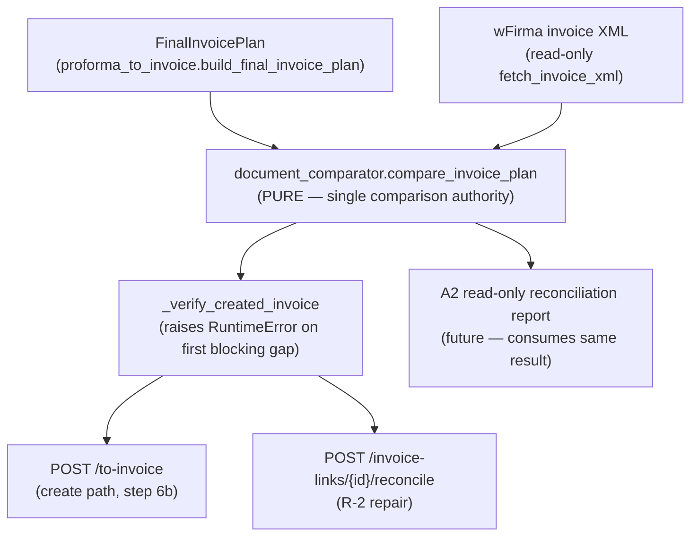

# ADR — Invoice Comparison Authority (`document_comparator`)

**Status:** Accepted (Campaign-2 A1 / hardened A1.1 — architecture review approved on PR #946, 2026-07-18)
**Date:** 2026-07-18
**Scope:** Proforma → Invoice verify-after-create + (future) read-only reconciliation
**Supersedes / relates:** verify-after-create hardening (`test_invoice_verify_after_create.py`),
Repo Integration Campaign, Document Reconciliation & Recovery master plan.

---

## Context

The Proforma→Invoice conversion path fetches the created wFirma invoice back and
compares it field-by-field against the `FinalInvoicePlan` it was built from. That
comparison matrix lived **inline** inside `routes_proforma._verify_created_invoice`
and raised `RuntimeError` on the first mismatch. It is the **single authority** for
that comparison, shared by the create path and the R-2 reconcile repair route.

The Document Reconciliation & Recovery engine (Campaign-2 A2+) needs the **same**
comparison to produce a *structured, classified* gap report (not just a raised
error). Re-implementing the matrix in the report path would create a **duplicate
authority** (two matrices drifting apart) — forbidden by the Engineering
Constitution ("one authority per concept", "readers are never writers") and OS-v1.4
§5/§12.

## Decision

Extract the comparison matrix into a new **pure** module,
`service/app/services/document_comparator.py`, as the single comparison authority:

- `compare_invoice_plan(plan, verify_xml) -> InvoiceComparisonResult` returns an
  ordered list of `Gap` objects, each carrying `field, expected, actual, authority,
  severity, resolution_policy, evidence_quality, message`.
- `_verify_created_invoice` **delegates**: it calls the comparator and raises
  `RuntimeError(first_blocking_gap().message)`. The exception type, message text,
  check order, ±0.02 tolerance, and conditional currency/receiver checks are
  **byte-for-byte preserved** (the fiscal creation gate is unchanged).
- The report path (A2) will consume the same `InvoiceComparisonResult` and surface
  **all** gaps with their classification — no second matrix.

The result type is named `InvoiceComparisonResult` (not `ReconciliationResult`) to
avoid collision with the unrelated `reconciliation_scorer.ReconciliationResult`
(packing design-no scoring): one result type, one meaning per repo.

## Authority & data-flow (dependency graph)

Direction is strictly one-way: planner + remote snapshot → comparator → gate →
callers. The comparator depends on nothing in `app/` (no routes, no DB, no client).

## Purity governance rule (permanent)

`document_comparator` MUST remain pure: **no** DB, HTTP, filesystem, audit,
environment mutation, or subprocess; exactly **one** XML parse per call; inputs
never mutated. Rationale: it is a fiscal comparison gate and a future report
source — a side effect here would turn a pure reader into a writer.

**Enforcement:** `tests/test_document_comparator_purity.py` fails CI if any
forbidden import/call is added or the parse-once rule is broken. Extending the
import allowlist requires updating this ADR.

## API-compatibility matrix (callers unchanged)

| Caller | Site | On blocking gap | HTTP surface | Audit | Operator-visible | Rollback |
|---|---|---|---|---|---|---|
| Create (`POST /to-invoice`) | `routes_proforma.py:4219` | `_verify_created_invoice` raises `RuntimeError` → caught → `plink.mark_failed` + `invoice_approval_attempt` (outcome=failed) | `{ok:false, status:"failed", verify_after_create_failed:true, error:<msg>}` | `invoice_approval_attempt` failed | `body["error"]` = identical message | invoice exists in wFirma; link=failed (unchanged) |
| Reconcile (`POST /invoice-links/{id}/reconcile`) | `routes_proforma.py:11901` | raises → caught → refuse repair, local state untouched | `{status:"refused", reconcile_refused:true, error:<msg>}` | none (read-only) | refusal message | no local change (unchanged) |

No caller interprets `InvoiceComparisonResult` directly; only `_verify_created_invoice`
imports the comparator. The comparator introduces **no new blocking authority**.

## Consequences

- **Positive:** single comparison authority reusable by the report path; pure and
  unit/property/mutation/golden-tested; gate contract preserved.
- **Neutral:** delegation adds one function call + one dataclass allocation per
  verify (~sub-µs; benchmark: ~101 µs/op dominated by XML parse, unchanged).
- **Guardrail:** the purity test permanently blocks side-effect creep.

## Alternatives rejected

1. **Duplicate the matrix in the report path** — creates drift / duplicate
   authority (constitution violation).
2. **Have the report call the raising gate and catch** — loses non-blocking
   (`info`/`warning`) gaps and multi-gap collection; couples report to HTTP-shaped
   failure semantics.
3. **Keep matrix inline, expose a second "report" function in routes** — business
   logic in the route layer; not reusable; violates layer separation.

## Verification evidence (A1.1)

- Contract suites: 128 passed (verify-after-create 22 + reconcile + conversion-route + comparator 27).
- Property harness: 3000 randomized cases — ordering/determinism/no-raise/gate-parity invariants hold.
- Golden corpus: 8 static XML snapshots pinned.
- Mutation testing: 11/11 mutants killed (100% score) via the internal mutation runner.
- Coverage: 100% under this campaign's **custom stdlib `trace` + AST executable-body
  line metric** (65/65 executable-body lines). Standard `coverage.py` **branch**
  coverage was **not** measured — `coverage.py` was unavailable and no package was
  installed into the shared interpreter. This is a line metric, not branch coverage.
- Baseline reproduction: the 5 unrelated failures reproduce on clean base SHA `46760572` → pre-existing.
